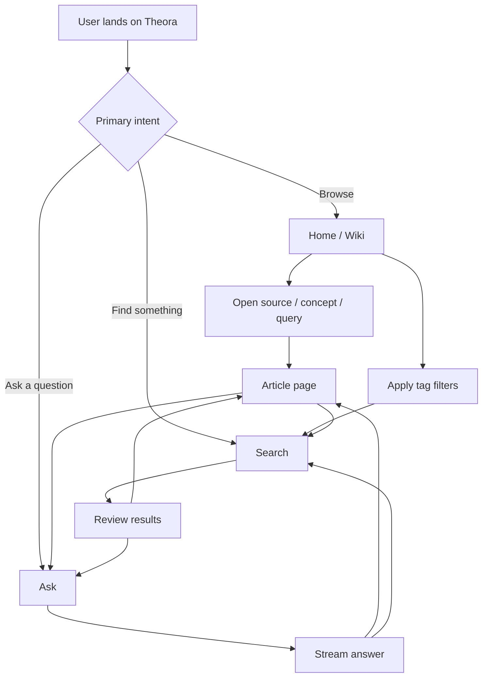
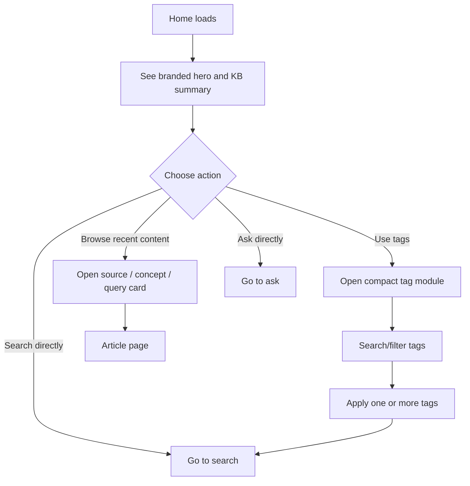
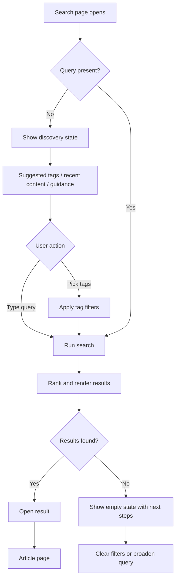
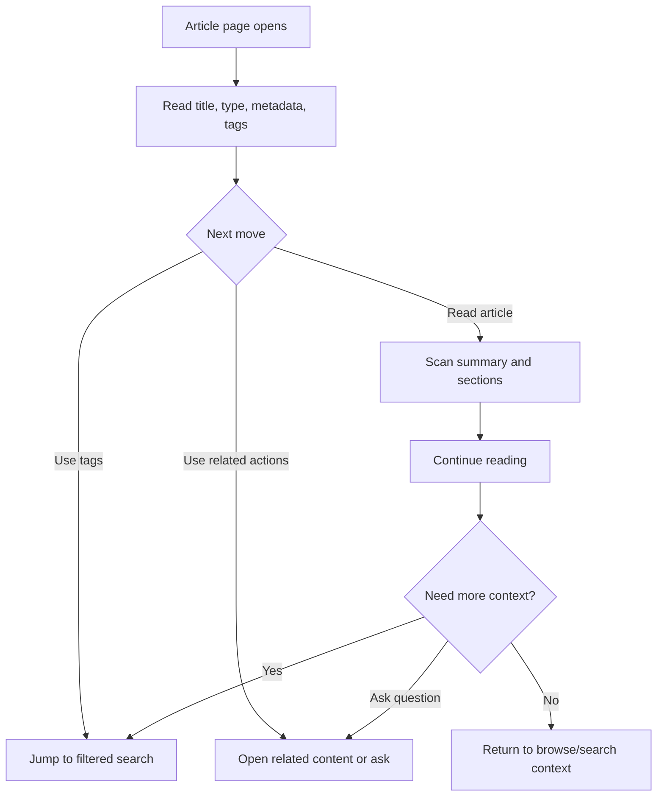
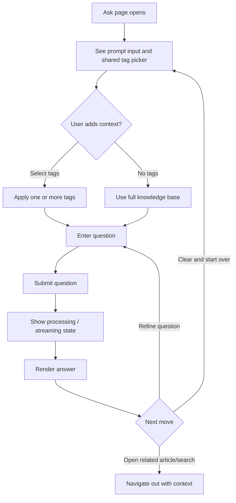

# Goal

Plan a UI and UX review for Theora's web interface and define a sequenced set of improvements that upgrades both the visual identity and the high-friction interaction flows.

# Summary

The current web app uses a minimal dark terminal-like presentation with red accents, simple navigation, flat cards, and unbounded tag chip lists. The user wants the interface to better reflect Theora Jones from *Max Headroom* through color palette, styling direction, and a custom SVG logo, while also improving the behavior and usability of the wiki, search, and tag-selection flows.

Screenshot review confirms several concrete problems in the current UI:

- the home screen is visually dominated by a full-screen tag dump before users reach primary content
- the search screen repeats the same tag-wall problem, making the filter system harder to use as the taxonomy grows
- the ask screen is underdeveloped compared to the rest of the product and exposes filtering as a weak free-text field
- article pages are readable but overly plain, with weak visual hierarchy, low-value metadata treatment, and little sense of related navigation
- the shared shell looks more like an early internal tool than a branded product tied to Theora / *Max Headroom*

The review and implementation plan should cover:

- visual direction and branding updates for the existing web shell
- better wiki browsing and article context
- improved search behavior and search result usefulness
- a scalable tag-selection UX that still works when the knowledge base has hundreds of tags
- a phased rollout so the work can be implemented in manageable chunks
- screenshot-based critique of the current UI in addition to code inspection

# Definition of Done

- The spec defines a clear visual direction for the app that references *Max Headroom* / Theora-inspired cues without requiring additional design interpretation during implementation.
- The spec identifies the current UI and UX weaknesses in the existing home, search, ask, and article views and turns them into concrete improvement requirements.
- The spec breaks the work into a practical sequence of implementation slices rather than one undifferentiated redesign.
- The spec defines expected behavior for search, wiki navigation, and tag selection in enough detail that an implementer can build them without making product decisions.
- The spec records screenshots as a required review input and explains how they inform the critique and prioritization.
- The spec treats the first implementation slice as the branded shell and design system rather than starting with interaction-only fixes.

# Core Flow

The revised experience should make the app feel like a coherent research console rather than a collection of separate plain forms.

Users land on a branded wiki home that introduces the knowledge base, exposes high-value navigation, and summarizes sources, concepts, queries, and tags without dumping the full tag inventory inline. From there they can:

- browse recent or important wiki content
- pivot by tag through a controlled filter experience
- search with clearer ranking, better snippets, and visible active filters
- open an article page with better context, metadata, and navigation back into related content
- ask questions with a tag-selection interaction that scales beyond free-text entry

The intended interaction pattern is:

1. Users arrive at a branded home screen that immediately communicates Theora's identity and the knowledge base status.
2. Users can jump into search, ask, or browse from prominent actions rather than scanning dense grids first.
3. Tags are managed through a compact searchable picker with multi-select support and visible active filter pills.
4. Search supports both discovery before typing and relevance-driven results after typing.
5. Article pages reinforce orientation with type, tags, related pathways, and clear return points into the rest of the knowledge base.

# Important Changes

- Replace the current generic mono-only dark shell with a stronger visual system derived from Theora / *Max Headroom*, including color tokens, typography choices, component styling rules, iconography guidance, motion guidance, and README-aligned copy guidance, plus an SVG logo requirement.
- Keep product naming and descriptive language aligned to the README, including `Theora`, `the oracle`, `LLM-powered knowledge base`, and `living wiki`.
- Use an SVG logo mark that pairs with visible `Theora` text rather than replacing the product name with a stylized wordmark.
- Implement the visual system through Tailwind-friendly theme tokens so palette swaps do not require component rewrites.
- Redesign top-level layout and navigation so the home, search, ask, and compile screens feel part of one product rather than isolated templates.
- Change tag handling from unbounded chip dumps and free-text fields to a compact, searchable, stateful selection pattern that remains usable with hundreds of tags.
- Improve search from basic substring matching presentation to a more intentional search UX with better query entry, filter visibility, result summaries, and empty-state behavior.
- Improve search behavior so the page is useful before query entry, the current filters are obvious, and result cards communicate why a document matched.
- Improve wiki article pages with stronger metadata presentation, related navigation, and clearer pathways back into search/tag exploration.
- Produce a phased implementation plan that starts with design system and layout work, then moves into search/tag UX, then article/wiki flow refinement.

The planned changes should include:

- A visual system layer in `src/web/styles/input.css` that introduces named CSS variables or token-like Tailwind utility targets for palette, spacing emphasis, surface treatments, borders, glow/highlight use, and typography.
- The visual system should support at least two named theme variants:
  - default theme based on Palette 2 (`Crimson Tube`, `Video Teal`, `Tape Gold`, `Carbon`, `Graphite`, `Fog`, `Paper White`)
  - alternate theme based on Palette 1 (`Signal Red`, `Phosphor Cyan`, `Electric Amber`, `Void Black`, `Panel Black`, `Scan Gray`, `Static White`)
- A reusable branded header treatment in `src/web/templates/layout.tsx` that supports the SVG logo, stronger navigation hierarchy, and a persistent page identity.
- Home-page restructuring in `src/web/templates/home.tsx` so summary metrics, key actions, recent content, and tag access are prioritized ahead of long content dumps.
- Search-page restructuring in `src/web/templates/search.tsx` so the screen supports:
  - discovery state when no query is present
  - visible active filters
  - multi-select tag controls
  - clearer result-type labels and snippets
  - an explicit empty state with next steps
- Ask-page restructuring in `src/web/templates/ask.tsx` so tag filtering uses the same controlled picker model as search instead of a raw text input.
- Article-page restructuring in `src/web/templates/article.tsx` so metadata, tag pivots, and related-navigation affordances are visible above the fold.
- Server and data-shape changes in `src/web/server.ts` and related helpers to support richer tag/filter state and search discovery content.
- Search helper changes in `src/lib/search.ts` so matching and scoring can incorporate title, tags, type, and content weighting in a way the UI can explain.

The screenshot-based review should explicitly address:

- home-page content order and above-the-fold priorities
- header/nav presence and brand signature
- information density versus scanning speed
- typographic hierarchy for titles, metadata, sections, and body copy
- whether tags act as filters, navigation, metadata, or all three, and how that role is expressed visually
- how much of the retro-broadcast style should appear in surfaces, separators, motion, and highlights without hurting readability

# Implementation Sequence

Phase 1 focuses on brand and shell:

- Define the visual language: palette, typography pairing, surface treatment, border language, interaction states, motion style, and README-aligned copy tone.
- Define the visual language as a token system first, not a one-off page skin.
- Add the new SVG logo and wire it into the layout alongside clearly readable `Theora` text.
- The logo direction is an icon or image mark with restrained signal-era detailing rather than a mascot, replacement wordmark, or literal character reference.
- Redesign the global layout, navigation, page header patterns, and shared card/form primitives.
- Use a cinematic-but-usable broadcast-console direction inspired by Theora Jones and *Max Headroom*, avoiding novelty effects that harm legibility.
- Rework the shell so the interface has a recognizable identity even before any page-specific content loads.

Phase 2 focuses on search and tag UX:

- Replace the current flat tag-chip dump with a searchable multi-select picker pattern.
- Use a compact tag summary area with active filter pills, remove controls, clear-all behavior, and overflow handling.
- Add discovery content to the search screen before query entry, such as recent sources, recent concepts, common tags, or suggested entry points.
- Improve result cards so they show document type, stronger snippets, matched tags, and stable sort behavior.
- Keep the interface usable on narrow screens by avoiding chip walls and wrapping controls into stacked mobile layouts.
- Remove the current pattern where filters consume more vertical space than the search task itself.

Phase 3 focuses on wiki and article flow:

- Improve article headers with type, compiled date, source information, ontology metadata, and related actions.
- Add pathways from articles into search or filtered browse views using tags and related content affordances.
- Rebalance the home screen to better support browsing the knowledge base without forcing users into long equal-weight grids.
- Review whether the ask flow should surface suggested tags or recent filters so users can reuse context more easily.
- Strengthen article-page hierarchy so source type, provenance, summary, and related pivots are easier to parse at a glance.

# Review Findings

The current home screen needs the largest structural change. It opens with stats followed immediately by a massive undifferentiated tag cloud, which pushes the actual knowledge content below the fold and makes the page feel cluttered even before the user starts browsing. Tags currently read as dumped metadata rather than a deliberate navigation tool.

The search screen has the same issue in a more acute form. The search input is visually prominent, but the rest of the page becomes a wall of filter chips with no grouping, no search within tags, no progressive disclosure, and no discovery state. This makes the interaction harder as the knowledge base becomes more useful, which is the wrong scaling behavior.

The ask screen is too sparse and inconsistent with the complexity of the app. It offers one strong text field and then falls back to a tiny optional tag input that assumes users already know the tag vocabulary. It needs the same tag-selection system as search and a stronger sense of context, guidance, and state.

The article screen is the strongest page today because the content itself carries the experience, but the interface still under-serves it. Metadata is visually flattened, the back link is weak, tags are present without much structure, and there is little framing around why this article matters or where to go next.

Across all screens, the visual language is functional but generic. The palette is mostly black, gray, and red outlines, which hints at the right reference material but does not yet feel like a designed system. The implementation plan should treat the current UI as a low-fidelity scaffold rather than something to lightly polish.

# Detailed Behavior

Theme behavior should be planned as follows:

- Tailwind usage should map components to semantic design tokens rather than raw palette hex values wherever practical.
- Theme tokens should cover at minimum: app background, panel background, elevated surface, primary text, secondary text, border, primary accent, secondary accent, warning accent, active state, focus ring, and muted tag treatment.
- Palette 2 is the default theme for the redesign.
- Palette 1 should remain available as an alternate theme variant without requiring component markup changes.
- Typography should also be tokenized so heading/display and mono/body choices can be adjusted centrally.

Logo behavior should be planned as follows:

- The primary logo is an SVG icon or image mark paired with visible `Theora` text in the header.
- The icon should be compact and crisp at small header sizes.
- Styling details should suggest signal/broadcast infrastructure through subtle geometry, but should avoid heavy glitch treatment or any form that obscures the product name.
- The logo mark should primarily use the theme's accent colors on dark surfaces.
- A simplified derived mark may be prepared later for favicon or compact states.
- The header should be designed so the icon and `Theora` text remain legible and visually distinct from the navigation labels.

Home-page flow should be planned as follows:

The tag picker should be one shared interaction model used in both search and ask:

- collapsed by default when space is constrained
- searchable within the tag list
- supports selecting multiple tags
- shows selected tags as removable pills outside the picker
- supports clear-all
- handles long tag lists through internal scrolling or grouped presentation instead of page-length wrapping
- remains keyboard accessible

Search behavior should be planned as follows:

- When there is no query, show a discovery state rather than an empty results area.
- When a query exists, preserve selected tags and make them visible in the result state.
- Results should explain match context through snippet text, document type labeling, and matched tag display.
- Result ordering should use an explicit weighting model rather than raw match count alone, with title and tag matches weighted above body text.
- Empty results should suggest next actions such as clearing filters or trying a broader query.
- The filter UI should prioritize quick narrowing over exhaustive visible listing.

Wiki/article behavior should be planned as follows:

- Article pages should show metadata early without forcing users to scan the markdown body first.
- Tag clicks from an article should send users into the search/browse experience with that filter already applied.
- Back navigation should return users to a meaningful place, not just a generic root.
- Related content affordances should prefer existing metadata and search helpers rather than introducing a new content graph in this iteration.
- The article header should feel like a contextual console panel, not just markdown preceded by a few pills.

Home-page behavior should be planned as follows:

- The first screenful should prioritize identity, summary, and primary actions instead of taxonomy exhaust.
- Tags should appear as a summarized navigation module, not an always-expanded inventory.
- Sources, concepts, and prior queries should not all compete with equal emphasis; the layout should establish a browsing order.
- Recent, high-signal, or featured content should be easier to reach than the full long-tail collection.

Ask-page behavior should be planned as follows:

# Test Cases and Scenarios

- A knowledge base with a small number of tags still feels lightweight and does not add unnecessary interaction cost.
- A knowledge base with hundreds of tags does not flood the page; users can quickly find, apply, review, and clear tag filters.
- A user can tell what part of the app they are in and move between wiki, search, ask, and compile without losing context.
- Search results remain understandable when a query matches many documents, few documents, or no documents.
- The search page remains useful before a query is entered and does not look unfinished or blank.
- A user opening a wiki article can understand what type of document it is, what tags apply, and what related next actions are available.
- The ask screen uses the same tag-selection model as search, so users do not have to learn two different filter behaviors.
- The branded visual treatment remains readable on desktop and mobile screen sizes.
- Motion and styling cues reinforce the theme without reducing readability or making controls feel unstable.
- The SVG logo works at desktop and mobile header sizes and remains readable on dark surfaces.
- Home no longer pushes the main content below the fold with an always-expanded tag inventory.
- Search keeps filters usable when the tag count is large and still feels lightweight when tag count is small.

# Assumptions and Defaults

- The planning scope is limited to the current server-rendered web interface under `src/web` and related search/wiki behavior already exposed there.
- The work should preserve the existing product structure (`wiki`, `search`, `ask`, `compile`) rather than redefining the app as a new product.
- The visual refresh should feel intentionally retro-futurist and broadcast-console inspired, not generic cyberpunk. Brand copy should stay grounded in the README rather than introducing new names, taglines, or product framings.
- Screenshots of the current interface will be used as explicit review input alongside source inspection.
- Branding scope includes theme, SVG logo, README-aligned copy tone, iconography cues, and motion/art-direction guidance for the web app.
- The first implementation slice focuses on the visual shell and branded system before deeper workflow changes.
- The preferred styling level is cinematic but usable, with strong references to Theora / *Max Headroom* but no sacrifice of routine readability.
- The default branded palette is Option 2, while Option 1 remains available as an alternate theme.
- Theme implementation should favor CSS custom properties surfaced through Tailwind utilities or semantic classes so palettes can be swapped with low churn.
- The primary logo concept is an icon-plus-text lockup, with `Theora` kept visible for immediate identification.
- The tag interaction model is multi-select, not single-select.
- The search page should show a discovery state before query entry rather than only responding after typing.
- Search improvements should stay within the existing local search architecture unless implementation review later shows a small supporting helper is needed.
- Screenshots that will be most useful for the review are the current home, search, ask, and article views on both desktop and a narrow/mobile-width viewport.
- The current screenshots are sufficient to document the primary desktop problems; a later mobile pass should refine layout details rather than redefine the direction.
