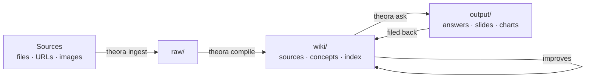
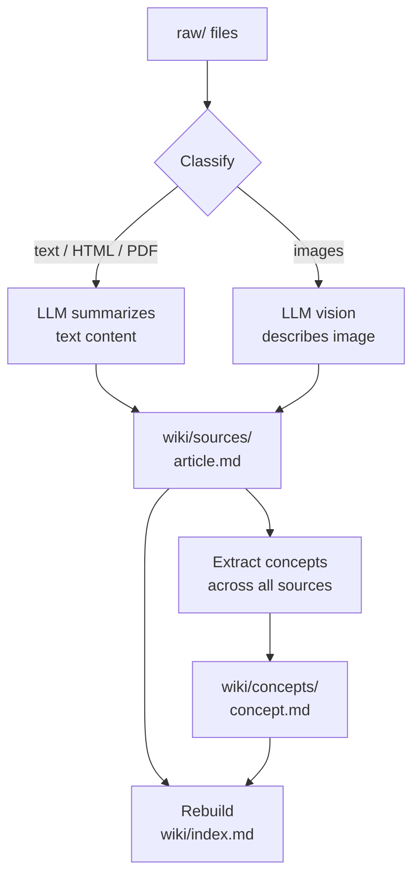
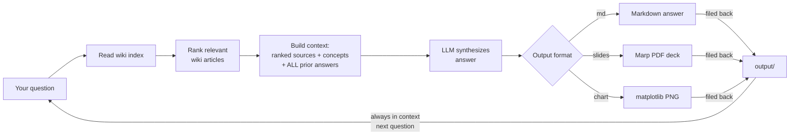
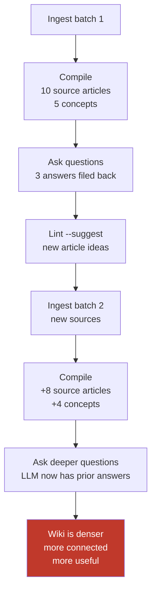

# Theora


> *"She's the one who actually knows how everything works."*

LLM-powered knowledge base that turns raw research into a living wiki.

Dump research into a folder. Let the model organise it into a wiki. Ask questions. The answers get filed back in. Every query makes the wiki smarter.

## The Name

**Theora** is named after Theora Jones — network controller and systems operator at Network 23 in *Max Headroom: 20 Minutes into the Future*. While others exploit the media landscape around her, Theora is the one who understands the infrastructure, keeps things running, and bridges systems and people. She's calm, competent, and grounded in a chaotic world.

It's also short for **the oracle** — a knowledge base that doesn't just store what you put in, but synthesises, connects, and answers. The more you feed it, the more it knows.

## Inspiration


Theora was directly inspired by two X posts: [@jumperz](https://x.com/jumperz/status/2039826228224430323?s=20) and Andrej Karpathy's viral ["LLM Knowledge Bases"](https://x.com/karpathy/status/2039805659525644595) post.

Karpathy described a shift away from using LLMs primarily to generate code, and toward using them to compile and maintain personal knowledge bases. The idea: dump raw source material — articles, papers, repos, datasets, images — into a `raw/` directory, then have an LLM incrementally "compile" a structured wiki of interlinked markdown files with summaries, backlinks, and concept articles. The LLM writes and maintains everything; you rarely touch the wiki directly. Once the wiki is large enough, you can ask complex questions against it, get synthesized answers, and file those answers back in — so every query compounds the knowledge base. He also described linting passes where the LLM scans for inconsistencies and suggests new articles, and output formats like Marp slides and matplotlib charts. Karpathy noted: "I think there is room here for an incredible new product instead of a hacky collection of scripts." Theora is that product.

> Built with [CommandCode](https://commandcode.ai)

## Why This Works

Most tools treat knowledge as static — you write notes, they sit there. Theora flips this. The LLM writes and maintains everything. You just steer.

The real insight is the loop:



Every answer filed back into the wiki makes the next answer better. The wiki compounds.

### The Compile Pipeline

`theora compile` transforms raw sources into a structured wiki in three stages:



Each source gets its own article with consistent sections — Summary, Key Points, Named Entities, Notable Details. Concepts are extracted across all sources and linked back. The index ties everything together with tags and a brief overview.

### The Ask Loop

`theora ask` is where the compounding happens:



The answer is filed back into `output/` and becomes part of the knowledge base. Prior answers are **always** included in context — they bypass the relevance ranker entirely. Every query adds to the base — your explorations compound.

### How the Wiki Improves Over Time



When you ask a question, the LLM researches your wiki, synthesizes an answer, and **files that answer back into the knowledge base**. The next question benefits from every previous answer. Your explorations compound. The wiki gets denser, more connected, more useful — not because you're writing, but because you're asking.

This is a second brain that builds itself.

The bigger implication: agents that own their own knowledge layer don't need infinite context windows. They need good file organization and the ability to read their own indexes. Way cheaper, way more scalable, and way more inspectable than stuffing everything into one giant prompt.

---

## Getting Started

### Prerequisites

**Required — Node.js 20+**

```bash
brew install fnm
eval "$(fnm env --use-on-cd)"   # add to ~/.zshrc for persistence
fnm install 22
fnm default 22
```

**Required — an LLM API key**

Get one from [OpenAI](https://platform.openai.com/api-keys) (default) or [Anthropic](https://console.anthropic.com/).

**Optional — slide deck export**

```bash
npm install -g @marp-team/marp-cli
```

Needed for `--output slides` to produce PDFs. Without it, the `.marp.md` source is still generated.

**Optional — chart generation**

```bash
pip3 install matplotlib
```

Needed for `--output chart`. Requires Python 3 (`brew install python` if not installed).

### Install

```bash
pnpm install
pnpm build
npm link
```

### Initialize a knowledge base

```bash
mkdir my-research && cd my-research
theora init my-research
```

`theora init` checks for optional dependencies and tells you what to install if anything is missing. It creates the directory structure and a `.env` file for your API keys:

```
raw/              Source documents you feed in
wiki/             LLM-compiled wiki (don't edit — the LLM owns this)
  index.md        Auto-maintained master index
  concepts/       Concept articles
  sources/        Source summaries
output/           Answers, slides, charts, and rendered outputs
.env              API keys
.theora/          Config, logs, and slide theme
```

### Global Configuration (Optional)

You can set up a global `.env` file at `~/.theora/.env` to share API keys across all knowledge bases:

```bash
theora init  # Creates ~/.theora/.env if it doesn't exist
```

**Environment File Hierarchy:**

Theora loads environment files in this order:

1. **Global `~/.theora/.env`** — Shared defaults across all KBs
2. **Current Directory `.env`** — For flexibility when running outside KB
3. **Knowledge Base `.env`** — Highest priority, KB-specific overrides
4. **System environment variables** — Available to the process before file loading

Later files override earlier ones. Unreadable `.env` files are skipped.

This means you can:
- Use `~/.theora/.env` for your main API keys (set once, use everywhere)
- Override with a KB-specific `.env` for special cases
- Check `theora settings` to see which .env file is active

### Add your API key

Edit `.env` in your knowledge base root:

```bash
# OpenAI (default)
OPENAI_API_KEY=sk-...

# Or OpenAI-compatible
# OPENAI_COMPATIBLE_BASE_URL=http://localhost:11434/v1
# OPENAI_COMPATIBLE_API_KEY=

# Or Anthropic
# ANTHROPIC_API_KEY=sk-ant-...
```

---

## Commands

### Ingest

Drop articles, papers, images, PDFs, or any text into the pipeline:

```bash
theora ingest ~/Downloads/some-paper.pdf
theora ingest ~/notes/research/*.md --tag transformers
theora ingest ./diagrams/*.png --tag architecture
```

Point it at an entire directory and it walks the tree, picking up every supported file:

```bash
theora ingest ~/research/project-alpha/
theora ingest ~/Downloads/conference-papers/ --tag neurips-2025
```

Ingest URLs directly — web pages are saved as HTML, remote images are downloaded as-is:

```bash
theora ingest https://example.com/article --tag research
theora ingest https://arxiv.org/abs/2310.01234 --tag transformers
theora ingest https://example.com/diagram.png --tag architecture
```

You can mix files, directories, and URLs in a single command:

```bash
theora ingest ./local-notes.md https://example.com/article ~/Downloads/paper.pdf --tag project
```

Only valid file types are ingested — everything else is skipped. Duplicates are detected automatically so you can re-run the same ingest without creating copies. Files get copied (flattened) into `raw/`.

Supported file types:

| Type | Extensions | How it's compiled |
|------|-----------|-------------------|
| Text | `.md` `.mdx` `.txt` `.html` `.json` `.csv` `.xml` `.yaml` | Read as text, summarized by LLM |
| PDF | `.pdf` | Text extracted, then summarized by LLM |
| Image | `.png` `.jpg` `.jpeg` `.gif` `.webp` | Analyzed via LLM vision, described and indexed |
| URL (page) | `http://` `https://` | Fetched as HTML, compiled as text |
| URL (image) | `http://` `https://` | Downloaded, analyzed via LLM vision |

Images are especially useful for diagrams, charts, screenshots, and figures from papers. The LLM describes what it sees, extracts any text or data, and links the image from the wiki article so you can view it in Obsidian.

### Compile

```bash
theora compile
```

The LLM reads every new source in `raw/`, writes a summary article for each, extracts key concepts into their own articles with backlinks, and rebuilds the master index. Run it again after ingesting new sources — it only processes what's new.

```bash
theora compile --sources-only    # skip concept extraction
theora compile --concepts-only   # delete and regenerate all concept articles from existing sources
theora compile --reindex         # just rebuild the index
theora compile --force           # delete existing articles and recompile everything from scratch
theora compile --concurrency 5   # run 5 parallel LLM calls (faster, uses more API quota)
theora compile --concurrency 1   # sequential (useful for debugging or strict rate limits)
```

Use `--concepts-only` to regenerate all concept articles without re-summarizing sources — useful after adding new sources or when you want concepts to reflect the latest wiki content. It clears `wiki/concepts/` and re-extracts from your already-compiled source articles.

Use `--force` when you want to reprocess all sources with updated prompts or settings. It clears `wiki/sources/` and `wiki/concepts/` then runs a full compile. Your `raw/` files are never touched.

By default, `theora compile` runs **3 parallel LLM calls** at a time — safe for both OpenAI and Anthropic rate limits. Use `--concurrency` to tune this per-run, or set a permanent default with `theora init --concurrency <n>` (stored in `.theora/config.json`).

### Ask

```bash
theora ask "what are the key differences between transformers and RNNs?"
theora ask "summarize the main findings across all papers"
theora ask "what open questions remain in this research area?"
```

Each `ask` builds context in two distinct tiers before calling the LLM:

**Tier 1 — Ranked wiki articles (sources + concepts)**

The wiki index is read first. If you have 10 or fewer wiki articles, all of them are included. With more than 10, a fast LLM call acts as a relevance ranker — it sees every article's title and path, picks the most relevant (up to 15), and those full articles become the context. If the ranker fails, the first 15 articles are used as a fallback.

Use `--tag` to pre-filter wiki articles before ranking — only articles tagged with that value are considered:

```bash
theora ask "what are the scaling challenges?" --tag transformers
```

**Tier 2 — Prior answers (always included)**

Every answer filed to `output/` is injected into context unconditionally — they bypass the ranker entirely. This is intentional: the ranker only sees titles and paths, not content. A prior answer titled *"what are the main themes?"* would never be ranked as relevant to a different question, even if its content is directly useful. By always including prior answers, every query you've asked compounds into the next one.

**Scaling note:** The two tiers have different scaling characteristics. Wiki articles scale reasonably well — the ranker caps selection at 15 regardless of how many articles exist. Prior answers don't scale the same way: every single filed answer is always injected in full, unconditionally. At a handful of answers this is fine. At dozens it's manageable. At hundreds, the context window fills up before the LLM even sees your question. If you're doing heavy research with frequent `ask` calls, use `--no-file` for exploratory questions and only file answers that genuinely add durable knowledge. Splitting a large research area across multiple focused knowledge bases also helps — fewer prior answers per KB means more headroom per query.

Use `--no-file` to ask without filing the answer back:

```bash
theora ask "quick question" --no-file
```

#### Output formats

**Markdown** (default) — a written answer filed to `output/`:

```bash
theora ask "what are the main themes?"
```

**Slides** — a Marp PDF deck:

```bash
theora ask "present the key findings" --output slides
```

Generates a [Marp](https://marp.app/) slide deck and converts it to PDF automatically if you have `marp-cli` installed. The `.marp.md` intermediate is always kept. See [Slide Decks](#slide-decks) below.

**Chart** — a matplotlib PNG:

```bash
theora ask "line chart of revenue by month" --output chart
```

See [Charts](#charts) below.

### Search

Full-text search across every compiled wiki article — sources and concepts:

```bash
theora search "attention mechanism"
theora search "transformer" -n 5
theora search "encoder" --tag transformers    # filter by tag
theora search anything --tags                 # list all tags
```

Search reads every article in `wiki/` and scores them using term frequency with bonuses:

| Signal | Score |
|--------|-------|
| Each occurrence of the term in title or body | +1 |
| Term appears in the article title | +5 bonus |
| A tag matches a query term | +3 bonus |

Results are ranked by score and show the article title, tags, file path, score, and a snippet of the first matching line.

Use `--tag` to pre-filter articles before scoring — only articles with that tag are searched:

```bash
theora search "performance" --tag transformers
```

Use `--tags` to list every tag in the wiki (no query needed):

```bash
theora search anything --tags
```

### Lint

Health-check the wiki for broken links, orphaned sources, and missing data:

```bash
theora lint
theora lint --suggest    # LLM suggests improvements and new articles
```

### Stats

Show LLM usage statistics — track API calls, tokens, costs, and performance over time:

```bash
theora stats               # Show stats for last 30 days
theora stats --days 7      # Show stats for last 7 days
theora stats --json        # Output as JSON for scripting
```

The stats command tracks every LLM call made by Theora, including:

- **Total calls, tokens, and estimated cost** — cumulative usage across all operations
- **Breakdown by action** — see costs for compile, ask, search, etc.
- **Breakdown by model** — compare usage across different LLM models
- **Daily activity** — track usage patterns over the last 7 days

Stats are stored per-knowledge-base in `.theora/llm-log.jsonl` and persist across sessions.

#### How Stats Collection Works

Every LLM call in Theora is automatically logged with detailed telemetry:

1. **Automatic Logging** — Each call to the LLM (compile, ask, search, etc.) records:
   - Timestamp and action type
   - Provider and model used
   - Input/output token counts
   - Duration (ms)
   - Estimated cost in USD

2. **Cost Estimation** — The system uses per-model pricing rates (OpenAI, Anthropic) to calculate estimated costs based on actual token usage.

3. **Log Storage** — Stats are appended to `.theora/llm-log.jsonl` as newline-delimited JSON, making them easy to parse and durable across sessions.

4. **Aggregation** — The `stats` command reads all log entries, filters by date range, and aggregates into summary statistics grouped by action, model, and day.

### Tail

Watch LLM call logs in real-time, similar to `tail -f`:

```bash
theora tail                    # Show last 20 log entries
theora tail -n 50              # Show last 50 entries
theora tail -f                 # Follow mode: watch for new entries
theora tail -f -n 5            # Follow mode, start with last 5 entries
theora tail --json             # Output as JSON
theora tail --compact          # Compact output (no colors)
```

The `tail` command shows a formatted table of LLM calls with timestamp, action, model, tokens, cost, and duration. In follow mode (`-f`), it polls every second for new entries and prints them as they arrive — useful for watching live activity while running compiles or queries.

---

## LLM Providers

Theora supports multiple LLM providers. OpenAI is the default.

| Provider | Default Model | API Key Variable |
|----------|--------------|-----------------|
| `openai` | `gpt-4o` | `OPENAI_API_KEY` |
| `openai-compatible` | `llama3.1:8b` | `OPENAI_COMPATIBLE_API_KEY` |
| `anthropic` | `claude-sonnet-4-20250514` | `ANTHROPIC_API_KEY` |

Set the provider at init time:

```bash
theora init my-research --provider anthropic
theora init my-research --provider openai --model gpt-4o-mini
theora init my-research --provider openai-compatible --model llama3.1:8b
theora init my-research --concurrency 5
```

For `openai-compatible`, set `OPENAI_COMPATIBLE_BASE_URL` to your server's `/v1` endpoint. `OPENAI_COMPATIBLE_API_KEY` is optional and defaults to an empty value for local servers that do not require authentication.

Or edit the KB-local `.theora/config.json` directly:

```json
{
  "provider": "anthropic",
  "model": "claude-sonnet-4-20250514",
  "compileConcurrency": 3,
  "conceptSummaryChars": 3000,
  "conceptMin": 5,
  "conceptMax": 10
}
```

| Key | Default | Description |
|-----|---------|-------------|
| `compileConcurrency` | `3` | Parallel LLM calls during compile |
| `conceptSummaryChars` | `3000` | Characters of each source article passed to the concept identification pass — higher values give the LLM more context but increase token usage |
| `conceptMin` | `5` | Minimum number of concepts to extract per compile run |
| `conceptMax` | `10` | Maximum number of concepts to extract per compile run |

### Per-Action Model Defaults

Each action uses a model optimized for its task. Cheaper models (`gpt-4o-mini`) are used for simpler tasks; full `gpt-4o` is reserved for quality-critical outputs.

| Action | Default Model | Task |
|--------|---------------|------|
| `compile` | `gpt-4o-mini` | Summarize text/PDF sources |
| `vision` | `gpt-4o` | Analyze images (needs vision capabilities) |
| `concepts` | `gpt-4o-mini` | Extract concept articles |
| `ask` | `gpt-4o` | Answer questions (quality matters) |
| `rank` | `gpt-4o-mini` | Rank article relevance (simple task) |
| `chart` | `gpt-4o` | Generate chart Python code |
| `slides` | `gpt-4o` | Generate slide decks |
| `lint` | `gpt-4o-mini` | Suggest improvements |

Override any action in your KB-local `.theora/config.json`:

```json
{
  "models": {
    "compile": "gpt-4o",
    "ask": "gpt-4o-mini"
  }
}
```

Unspecified actions keep their defaults.

API keys can live in either the knowledge base `.env` or the global `~/.theora/.env`. KB-local values override global ones. These files are gitignored by default when they live in the knowledge base.

---

## Tags

Tags are how you tell the wiki what things are about. Without tags, the LLM guesses — and it's decent at guessing. But when you're researching multiple topics at once, tags keep everything organized and findable.

### Two layers of tagging

**You tag at ingest time.** When you run `theora ingest paper.pdf --tag transformers`, that tag flows into the compile step. The LLM sees it and uses it to categorize the article — it'll include "transformers" in the frontmatter tags and use that context to write a better summary.

**The LLM also generates its own tags.** During compilation, the LLM reads each source and adds tags based on the content. If you tagged a paper "transformers" but it also covers attention mechanisms and encoder-decoder architectures, the LLM will add those too. Your tag seeds the categorization; the LLM expands it.

Both layers end up in the article's YAML frontmatter:

```yaml
---
title: "Attention Is All You Need"
tags: [transformers, attention-mechanism, encoder-decoder, self-attention]
---
```

### Why tags matter

Tags are the cross-cutting links in your wiki. The directory structure gives you two buckets — `sources/` and `concepts/` — but tags let you slice across both:

- **Filter search results**: `theora search "performance" --tag transformers` — only show results tagged "transformers"
- **See all tags**: `theora search anything --tags` — list every tag in the wiki
- **Index grouping**: `theora compile --reindex` rebuilds the master index with a Tags section showing which articles share each tag
- **Better Q&A**: when you `theora ask` a question, the LLM sees tags in the index and uses them to find relevant articles faster

### When to use tags

Use tags when you're researching multiple topics. If your knowledge base covers one narrow subject, tags are nice but not critical — the LLM will figure it out. But once you're ingesting papers on transformers _and_ diffusion models _and_ reinforcement learning, tags are what keep the wiki navigable.

Tag at ingest time, not after. It's one flag: `--tag transformers`. The earlier you tag, the better the LLM categorizes.

```bash
theora ingest ./papers/attention/*.pdf --tag transformers
theora ingest ./papers/diffusion/*.pdf --tag diffusion
theora ingest ./papers/rl/*.pdf --tag reinforcement-learning
theora ingest ./diagrams/*.png --tag architecture

theora search "scaling laws" --tag transformers
theora ask "compare the training approaches" --tag diffusion
```

---

## Slide Decks

Theora can generate slide decks from your wiki using [Marp](https://marp.app/). The LLM structures its answer as slides — title slide, focused bullet points, section dividers, and a summary at the end. If you have `marp-cli` installed, the deck is automatically exported to PDF.

### Setup

```bash
npm install -g @marp-team/marp-cli
```

Without it, Theora still generates the `.marp.md` source file — you just won't get the PDF automatically.

### Generate slides

```bash
theora ask "present the key findings on attention mechanisms" --output slides
theora ask "compare transformer architectures" --output slides
theora ask "give a 10-slide overview of this research area" --output slides
```

This produces two files in `output/`:
- `<slug>.pdf` — the final slide deck (if marp-cli is installed)
- `<slug>.marp.md` — the Marp markdown source (always kept)

### View slides

- **PDF** — open in any viewer
- **Obsidian** — install the [Marp Slides](https://github.com/samuele-cozzi/obsidian-marp-slides) plugin to preview `.marp.md` files as slides
- **VS Code** — install the [Marp for VS Code](https://marketplace.visualstudio.com/items?itemName=marp-team.marp-vscode) extension
- **Manual export** — `marp output/my-slides.marp.md -o slides.html`

### Theming

`theora init` creates a default slide theme at `.theora/theme.css`. Customize it to control fonts, colors, and layout for all generated decks:

```css
:root {
  --color-accent: #c0392b;
  --color-fg: #1a1a2e;
  --color-bg: #ffffff;
  --font-heading: 'Inter', sans-serif;
  --font-body: 'Inter', sans-serif;
  --font-code: 'JetBrains Mono', monospace;
}
```

If you delete `.theora/theme.css`, slides fall back to Marp's built-in default theme.

### Good slide prompts

```bash
# Good — specific
theora ask "present the 5 most important findings with evidence" --output slides
theora ask "create a tutorial on how attention mechanisms work" --output slides

# Less good — too vague
theora ask "tell me about transformers" --output slides
```

---

## Charts

`theora ask` can generate matplotlib charts directly from your wiki data using `--output chart`. The LLM reads the relevant wiki articles, extracts the data, and writes a Python script that renders a PNG.

### Setup

```bash
pip3 install matplotlib
```

Python 3 must be available in your PATH.

### Generate charts

```bash
theora ask "line chart of revenue by month" --output chart
theora ask "pie chart of customer segments" --output chart
theora ask "bar chart of user signups over time" --output chart
theora ask "scatter plot of price vs volume" --output chart
```

This produces two files in `output/`:
- `<slug>.png` — the rendered chart
- `<slug>.py` — the Python source (always kept)

A markdown note referencing the PNG is also filed back into `output/` so the chart compounds into the knowledge base.

### How it works

The LLM reads the wiki, extracts relevant numbers and categories as inline Python data, and generates a complete self-contained matplotlib script. No pandas, no CSV files — just Python literals derived from your wiki content. The chart type is chosen automatically based on the data and your question.

If rendering fails, the `.py` source is saved and you can fix and re-run it manually:

```bash
python3 output/my-chart.py
```

### Good chart prompts

```bash
# Good — specific chart type and data
theora ask "line chart of monthly revenue for the last year" --output chart
theora ask "horizontal bar chart comparing feature adoption rates" --output chart
theora ask "pie chart breaking down revenue by product category" --output chart

# Less good — too vague
theora ask "show me the data" --output chart
```

---

## How It Compounds

A typical session:

1. Ingest 10 papers on a topic
2. `theora compile` produces 10 source summaries + 5 concept articles + an index
3. Ask "what are the main themes?" — answer filed back
4. Ask "where do the authors disagree?" — answer filed back, now cross-referencing the previous answer
5. Ask "what's missing from this research?" — the LLM now has your previous analysis to build on
6. `theora lint --suggest` finds gaps and suggests new articles
7. Ingest more sources, compile again — the wiki grows

Each cycle makes the next one better. The wiki isn't a snapshot — it's a living document that gets smarter every time you interact with it.


