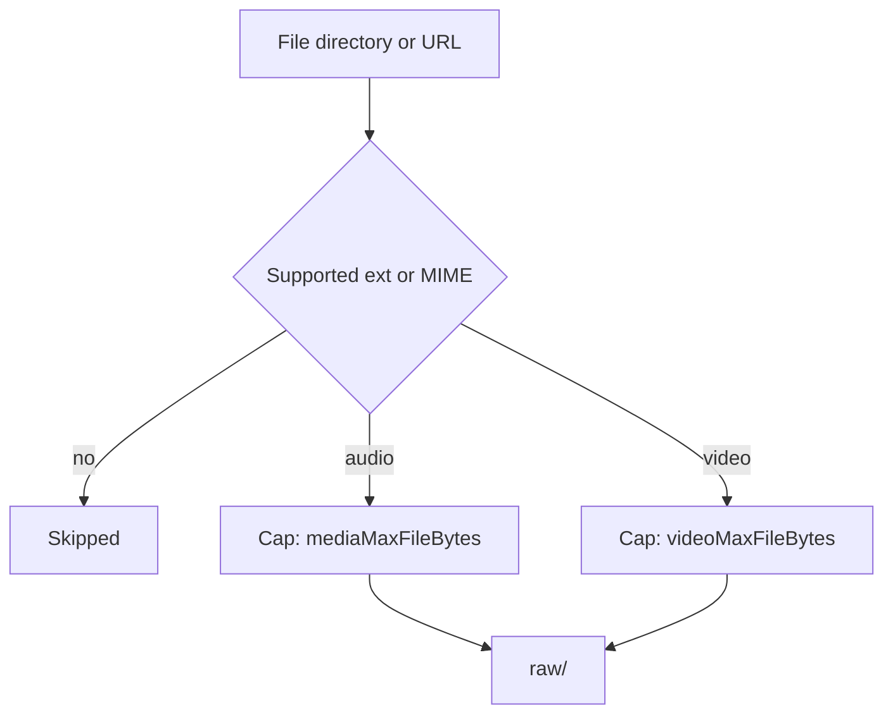
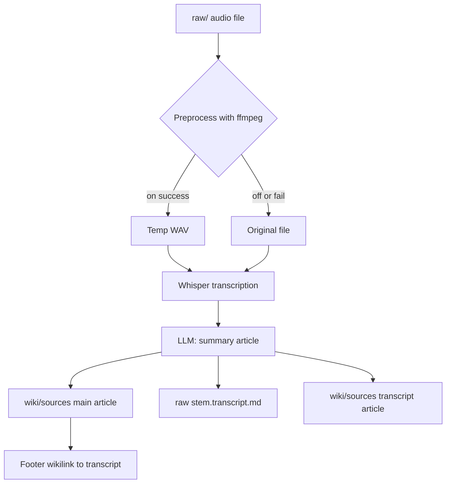
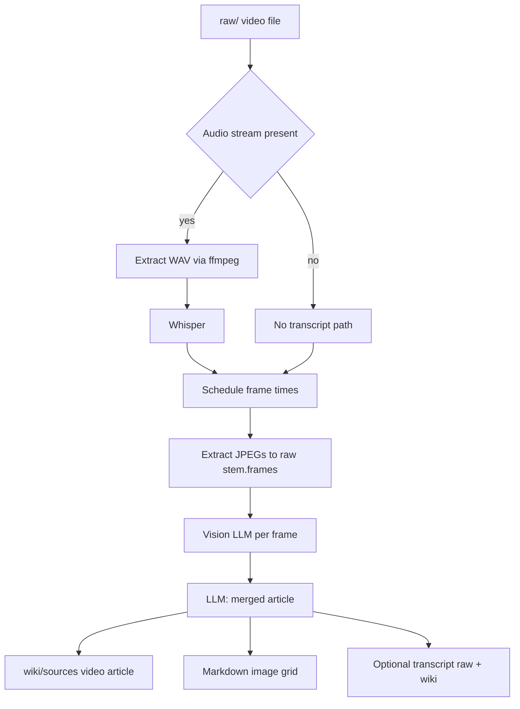

# Commands

## Ingest

Drop articles, papers, images, PDFs, or any text into the pipeline:

```bash
theora ingest ~/Downloads/some-paper.pdf
theora ingest ~/notes/research/*.md --tag transformers
theora ingest ./diagrams/*.png --tag architecture
```

Point it at an entire directory and it walks the tree, picking up every supported file:

```bash
theora ingest ~/research/project-alpha/
theora ingest ~/Downloads/conference-papers/ --tag neurips-2025
```

Ingest URLs directly — web pages are saved as HTML, remote images are downloaded as-is:

```bash
theora ingest https://example.com/article --tag research
theora ingest https://arxiv.org/abs/2310.01234 --tag transformers
theora ingest https://example.com/diagram.png --tag architecture
```

YouTube URLs take a captions-first path: Theora uses `yt-dlp` to fetch metadata plus captions, then stores the transcript as a normal markdown source in `raw/` so compile can treat it like any other text document:

```bash
theora ingest https://www.youtube.com/watch?v=VIDEO_ID --tag research
theora compile
```

You can mix files, directories, and URLs in a single command:

```bash
theora ingest ./local-notes.md https://example.com/article ~/Downloads/paper.pdf --tag project
```

Only valid file types are ingested — everything else is skipped. Duplicates are detected automatically so you can re-run the same ingest without creating copies. Files get copied (flattened) into `raw/`.

Supported file types:

| Type | Extensions | How it's compiled |
|------|-----------|-------------------|
| Text | `.md` `.mdx` `.txt` `.html` `.json` `.csv` `.xml` `.yaml` | Read as text, summarized by LLM |
| PDF | `.pdf` | Text extracted, then summarized by LLM |
| Image | `.png` `.jpg` `.jpeg` `.gif` `.webp` | Analyzed via LLM vision, described and indexed |
| Audio | `.mp3` `.wav` `.ogg` `.flac` `.m4a` | Transcribed with OpenAI Whisper (`whisper-1`), then summarized like text |
| Video | `.mp4` `.mov` `.avi` `.mkv` `.webm` | Requires **ffmpeg** (on macOS, install with [Homebrew](https://brew.sh): `brew install ffmpeg`). Audio transcribed with Whisper; evenly sampled frames analyzed with vision; one merged wiki article |
| YouTube Video | `youtube-<id>.md` | YouTube transcripts ingested via `theora ingest <youtube-url>`. Compiled as **text** (no frame extraction, no ffmpeg). Displays with YouTube icon in wiki. Frontmatter: `source_type: youtube` |
| URL (page) | `http://` `https://` | Fetched as HTML, compiled as text |
| URL (image) | `http://` `https://` | Downloaded, analyzed via LLM vision |
| URL (audio/video) | `http://` `https://` | Streamed to disk; video uses `videoMaxFileBytes`, other media `mediaMaxFileBytes` (same rules as local ingest) |
| URL (YouTube) | `https://www.youtube.com/watch?...` `https://youtu.be/...` | Requires **yt-dlp**. Fetches metadata + captions only, then saves `raw/youtube-<video-id>.md` without downloading video |

**Whisper and API keys:** Transcription always uses the **OpenAI** audio API (`models.transcribe`, default `whisper-1`). Set `OPENAI_API_KEY`, or use `OPENAI_TRANSCRIBE_API_KEY` if you want a separate key. Chat/vision still follow `provider` in `.theora/config.json` (e.g. Anthropic for compile/vision).

**Media settings** (optional in `.theora/config.json`): `mediaMaxFileBytes` (default 50 MiB for audio, images, documents, etc.), `videoMaxFileBytes` (default 100 MiB for video files and `video/*` URL responses), `videoFramesPerMinute`, `videoMinFrames`, `videoMaxFrames`, `videoFrameVisionMaxEdgePx`, `videoFrameJpegQuality`, `compileMediaTranscriptMaxChars`, `whisperPreprocessAudio`, `whisperAudioTargetSampleRateHz`, `whisperAudioMono`.

### Audio and video: ingest and compile flows

**Ingest** copies or streams files into `raw/` (same extensions as in the table above). Size limits depend on type: audio uses `mediaMaxFileBytes`; video files and `video/*` URL responses use `videoMaxFileBytes`. URL ingest runs an SSRF guard before fetch. Supported YouTube URLs are a captions-first exception: Theora shells out to `yt-dlp`, fetches metadata plus captions, and writes a markdown transcript source instead of downloading media. Companion files produced at compile time (`*.transcript.md`, `{stem}.frames/`) are not separate ingest targets—they are created when you compile.



**Audio compile** — Whisper transcription (OpenAI) then an LLM writes the wiki article. Optional ffmpeg step normalizes to WAV for Whisper when `whisperPreprocessAudio` is on. Verbatim transcript is saved as `raw/{stem}.transcript.md` and a matching wiki source, with links from the main audio article.



**Video compile** — Requires **ffmpeg**. ffprobe detects an audio stream: if none, compilation uses **frame analysis only** (no Whisper, no transcript files). If audio exists, ffmpeg extracts WAV → Whisper → transcript. Preview JPEGs are written to `raw/{stem}.frames/` and shown as a grid in the wiki article; each frame is also sent to **vision** for description before the final LLM merges transcript + frame notes into one article.



Images are especially useful for diagrams, charts, screenshots, and figures from papers. The LLM describes what it sees, extracts any text or data, and links the image from the wiki article so you can view it in Obsidian.

## Compile

```bash
theora compile
```

The LLM reads every new source in `raw/`, writes a summary article for each, extracts key concepts into their own articles with backlinks, and rebuilds **`wiki/index.md`** plus the **lexical search index** (`.theora/search-index.json`). Run it again after ingesting new sources — it only processes what's new.

```bash
theora compile --sources-only    # skip concept extraction
theora compile --source foo.md   # recompile one raw source, skip concepts; rebuild wiki index + search index
theora compile --concepts-only   # delete and regenerate all concept articles from existing sources
theora compile --reindex         # rebuild wiki/index.md + .theora/search-index.json (no source/concept passes)
theora compile --force           # delete existing articles and recompile everything from scratch
theora compile --concurrency 5   # run 5 parallel LLM calls (faster, uses more API quota)
theora compile --concurrency 1   # sequential (useful for debugging or strict rate limits)
```

### Reindexing

After **every** compile path that finishes successfully (full compile, `--sources-only`, `--source`, `--concepts-only`, or `--reindex` alone), Theora rebuilds:

1. **`wiki/index.md`** — master Obsidian-style index: sources, concepts, optional mind maps / previous-queries sections, and the **Tags** grouping.
2. **`.theora/search-index.json`** — persisted **BM25** inverted index used by CLI `theora search` and the web wiki **Search** page.

Building **`.theora/search-index.json`** is **local only** (token counts and BM25 statistics from markdown on disk — no LLM). Regenerating **`wiki/index.md`** can still call the LLM for the **Overview** section when the wiki has at least one article. Use **`theora compile --reindex`** when you edited wiki or `output/` files by hand, added mind maps or filed answers, or search/index feel out of date — without re-running source or concept passes.

Use `--concepts-only` to regenerate all concept articles without re-summarizing sources — useful after adding new sources or when you want concepts to reflect the latest wiki content. It clears `wiki/concepts/` and re-extracts from your already-compiled source articles.

Use `--source <raw-file>` when you want to refresh exactly one raw source article without running a full source pass. It accepts either a bare filename (for example `foo.md`) or a path relative to `raw/` (for example `tag/foo.md`), overwrites the matching `wiki/sources/<slug>.md`, refreshes source-specific companion artifacts, skips concept extraction, and still rebuilds **`wiki/index.md`** and **`.theora/search-index.json`**. It is intentionally incompatible with `--force`, `--concepts-only`, and `--reindex`.

Use `--force` when you want to reprocess all sources with updated prompts or settings. It clears `wiki/sources/` and `wiki/concepts/` then runs a full compile. Your `raw/` files are never touched.

By default, `theora compile` runs **3 parallel LLM calls** at a time — safe for both OpenAI and Anthropic rate limits. Use `--concurrency` to tune this per-run, or set a permanent default with `theora init --concurrency <n>` (stored in `.theora/config.json`).

### Compile error handling

When compilation fails, Theora provides human-friendly error messages and persists detailed error logs for debugging:

```
✗ Compilation failed for youtube-3Co8Z8BQgWc.md

The file does not appear to be a valid video file.

Suggestions:
  • The file may not be a valid video file.
  • Check that the file extension matches the actual content (e.g., .mp4, .mov, .avi).
  • If this is a YouTube transcript markdown file, it should be processed as text, not video.

Error details saved to: /Users/you/.theora/logs/compile-youtube-3Co8Z8BQgWc-2026-04-13T08-05-12-000Z.log
You can review the full error log for more technical details.
```

**Error logs** are stored in `~/.theora/logs/` with one log file per failed compilation (not appended). Each log contains:
- Timestamp and source file
- Error type classification (ffmpeg, ffprobe, invalid_format, etc.)
- Full error message and command that failed
- Actionable suggestions for fixing the issue

At the end of a batch compile, if any sources failed, you'll see a summary:

```
⚠ Compiled 7/8 sources (1 failed)

1 compilation failure:
  • youtube-3Co8Z8BQgWc.md → /Users/you/.theora/logs/compile-youtube-3Co8Z8BQgWc-2026-04-13T08-05-12-000Z.log
```

## Ask

```bash
theora ask "what are the key differences between transformers and RNNs?"
theora ask "summarize the main findings across all papers"
theora ask "what open questions remain in this research area?"
```

In **zsh**, `?`, `*`, and `[` in an unquoted question are treated as globs, which can fail before `theora` runs (for example `theora ask what is pi?`). Quote the question, or pass it on **stdin** with `--stdin` so the shell never expands those characters:

```bash
theora ask --stdin <<< 'what is pi?'
printf '%s\n' 'Any question with ? * or [chars]?' | theora ask --stdin
```

`--stdin` reads the full question from stdin (trimmed of trailing newlines). Do not pass a positional question when using `--stdin`. Other flags such as `--no-file`, `--tag`, and `--output` work the same as with a normal `ask`.

Each `ask` builds context in two distinct tiers before calling the LLM:

**Tier 1 — Ranked wiki articles (sources + concepts)**

The wiki index is read first. If you have 10 or fewer wiki articles, all of them are included. With more than 10, a fast LLM call acts as a relevance ranker — it sees every article's title and path, picks the most relevant (up to 15), and those full articles become the context. If the ranker fails, the first 15 articles are used as a fallback.

Use `--tag` to pre-filter wiki articles before ranking — only articles tagged with that value are considered:

```bash
theora ask "what are the scaling challenges?" --tag transformers
```

**Tier 2 — Prior answers (always included)**

Every answer filed to `output/` is injected into context unconditionally — they bypass the ranker entirely. This is intentional: the ranker only sees titles and paths, not content. A prior answer titled _"what are the main themes?"_ would never be ranked as relevant to a different question, even if its content is directly useful. By always including prior answers, every query you've asked compounds into the next one.

**Scaling note:** The two tiers have different scaling characteristics. Wiki articles scale reasonably well — the ranker caps selection at 15 regardless of how many articles exist. Prior answers don't scale the same way: every single filed answer is always injected in full, unconditionally. At a handful of answers this is fine. At dozens it's manageable. At hundreds, the context window fills up before the LLM even sees your question. If you're doing heavy research with frequent `ask` calls, use `--no-file` for exploratory questions and only file answers that genuinely add durable knowledge. Splitting a large research area across multiple focused knowledge bases also helps — fewer prior answers per KB means more headroom per query.

Use `--no-file` to ask without filing the answer back:

```bash
theora ask "quick question" --no-file
```

### Output formats

**Markdown** (default) — a written answer filed to `output/`:

```bash
theora ask "what are the main themes?"
```

**Slides** — a Marp PDF deck:

```bash
theora ask "present the key findings" --output slides
```

Generates a [Marp](https://marp.app/) slide deck and converts it to PDF automatically if you have `marp-cli` installed. The `.marp.md` intermediate is always kept. See [Slide Decks](slide-decks.md).

**Chart** — a matplotlib PNG:

```bash
theora ask "line chart of revenue by month" --output chart
```

See [Charts](charts.md).

## Serve

Start the **local web UI** (Hono + HTMX) for your active knowledge base — wiki, search, ask, compile, stats, settings, and ingest.

```bash
theora serve
theora serve -p 8080
```

By default the startup banner shows **localhost** and your **KB root**.

Use **`--share`** when you want to open the app from another device on the same Wi‑Fi: the banner also lists **LAN URLs**, prints a **terminal QR code** (for the first IPv4 address), and reminds you about **Safari on iOS** blocking some plain `http://` pages unless you adjust **Settings → Safari → Privacy & Security → Not Secure Connection Warning**.

```bash
theora serve --share
```

**HTTP vs HTTPS.** `theora serve` listens for **unencrypted HTTP** only (`http://` on localhost or your LAN IP). That is normal for local development: no TLS certificates, no browser padlock. **HTTPS** adds TLS so traffic is encrypted and browsers treat the site as “secure”; mobile Safari in particular may refuse or hassle plain **HTTP** on LAN IPs when stricter privacy settings are on. Theora does not terminate HTTPS inside `serve`; for encryption you either put a reverse proxy in front of the app or use a tunnel (below).

**Tip — tunnels for real HTTPS.** To open the wiki from a phone without fighting HTTP-only policies, run **`theora serve`** (or `theora serve -p <port>`) and expose it with a tunnel that gives you an **`https://…`** URL, for example **[ngrok](https://ngrok.com/)** (`ngrok http 4000`), **[Cloudflare Tunnel](https://developers.cloudflare.com/cloudflare-one/connections/connect-apps/)** (`cloudflared tunnel --url http://localhost:4000`), or similar. Point the tunnel at the same host and port Theora uses; share that HTTPS link or QR from the tunnel tool instead of the LAN QR from `--share`. Remember: anyone with the tunnel URL can reach your server unless the product adds access control — treat it like exposing a dev server.

| Option | Meaning |
| ------ | ------- |
| `-p, --port <port>` | TCP port to listen on (default **`4000`**). |
| `--share` | Show LAN URLs, QR code, and Safari tips for phone / tablet access on your network. |

## Search

**Lexical search** over compiled markdown: everything under **`wiki/`** (sources and concepts) and **`output/`** (filed answers, mind maps, and other generated markdown). This is **not** semantic Q&A — for that, use **`theora ask`**, which ranks articles with an LLM and synthesizes an answer.

```bash
theora search "attention mechanism"
theora search "transformer" -n 5
theora search "encoder" --tag transformers    # filter by tag
theora search anything --tags                 # list all tags
```

The **web wiki** (`theora serve`) exposes the same engine on the **Search** page.

### How search works

1. **Index** — On each [reindex](#reindexing) (including any full compile that finishes with index rebuild), Theora writes **`.theora/search-index.json`**: stemmed tokens, per-field term counts, and BM25 corpus statistics. If that file is missing (for example an older KB created before this feature), run **`theora compile --reindex`** once.

2. **Tokenization** — Queries and documents are split on Unicode word boundaries; **English Porter stemming** is applied by default (configurable; changing **`search.stemming`** requires a reindex).

3. **Ranking** — **BM25** is computed separately for **title**, **body**, and **tags**, then combined using configurable **`search.fieldWeights`**. The combined score is multiplied by **recency** (from front matter `date`, `date_compiled`, or file mtime) and by **`search.outputWeight`** for articles under **`output/`**, so filed answers do not drown out sources and concepts.

4. **Snippets** — The UI shows a short excerpt from the line that best matches the query stems; literal highlighting uses **escaped** substrings so characters like `$` or `(` do not break matching.

5. **“Did you mean”** — If there are no hits or the top score is below **`search.weakScoreThreshold`**, optional **fuzzy** suggestions (Levenshtein on title/tag vocabulary) propose an alternate query. The CLI prints a line; the web UI links to the suggested search.

Optional tuning lives under **`search`** in **`.theora/config.json`** (merged with defaults on read). Useful keys: **`fieldWeights`** (`title`, `body`, `tags`), **`outputWeight`**, **`recencyHalfLifeDays`** (`0` disables recency decay), **`stemming`**, **`fuzzy`**, **`fuzzyMaxEdits`**, **`fuzzyMinTokenLength`**, **`weakScoreThreshold`**.

Use `--tag` to pre-filter articles before scoring — only articles with that tag are searched:

```bash
theora search "performance" --tag transformers
```

Use `--tags` to list every tag in the wiki (no query needed):

```bash
theora search anything --tags
```

## Map

`theora map` builds a **focal graph** of your compiled wiki (sources, concepts, tags, entities, and links between them) and writes **[Markmap](https://markmap.js.org/repl)**-compatible markdown under `output/`. No headless browser is involved: you get a `.md` file you can open in Markmap tooling, IDEs, or static viewers.

**Interactive (default in a TTY)** — Run `theora map` with no focus flags. You choose a focal mode (concept, ontology + concept, source, or tag), then depth and max node count.

**Non-interactive** — Supply **exactly one** primary focus so nothing is prompted:

| Flag | Role |
| ---- | ---- |
| `--around <slug>` | Center on a wiki article slug (concept, source, or filed `output/` markdown). Slug: lowercase letters, digits, hyphens only (`^[a-z0-9][a-z0-9-]*$`). |
| `--tag <tag>` | **Without** `--around`: center on that tag. **With** `--around`: keep the article center but only expand through articles that have this tag. |
| `--entity <key>` | Center on an entity key as stored in front matter: `category:name` (e.g. `person:jane-doe`). |
| `--overview` | Center on a KB-wide hub graph; root label comes from `name` in `.theora/config.json`. |

Using more than one of `--overview`, `--entity`, `--around`, or tag-as-center (`--tag` without `--around`) is an error.

**Other options**

| Option | Meaning |
| ------ | ------- |
| `--ontology <type>` | Restrict which concept articles participate. Values are the allowlist in [`src/lib/wiki.ts`](../src/lib/wiki.ts) (`ONTOLOGY_TYPES`): core types (`person`, `organization`, `place`, …), creative subtypes (`movie`, `book`, `tv-series`, …), roles (`actor`, `musician`, `visual-artist`), and general KB types (`dataset`, `website`, `educational-organization`, …). |
| `--depth <n>` | Article hops from the focal point, 1–8 (default `2`). |
| `--max-nodes <n>` | Hard cap on graph size, 4–200 (default `48`). |
| `--expand-level <n>` | Optional Markmap hint `initialExpandLevel` in YAML front matter, 1–8. |
| `--output <basename>` | Write under `output/` using this basename only (safe join; extension added if omitted). |
| `--graph-json` | Also write a `.graph.json` next to the diagram. |
| `--no-interactive` | Never prompt; required in non-TTY environments unless you pass a focus flag above. |

Examples:

```bash
theora map                                              # TTY: guided focal + depth + max nodes
theora map --around attention-mechanisms                # article slug
theora map --around my-concept --tag ml                 # same center, tag-filtered expansion
theora map --tag architecture                           # center on tag
theora map --entity person:ada-lovelace
theora map --overview --depth 4 --max-nodes 64
theora map --around my-slug --expand-level 3 --graph-json
```

Saved files use YAML front matter like other filed output: **`title`** (`{focus} Mind Map`), **`type: mind-map`**, **`date`**, and optional **`markmap`** settings. They appear in the wiki listing and search like other `output/` articles. After adding or regenerating maps, run **`theora compile --reindex`** so **`wiki/index.md`** lists them under **Mind maps** (separate from **Previous Queries**) and **`.theora/search-index.json`** includes them for search.

The web wiki exposes the same graph as an interactive view at **`/wiki/map`**.

## Lint

Health-check the wiki for broken links, orphaned sources, and missing data:

```bash
theora lint
theora lint --suggest    # LLM suggests improvements and new articles
```

## Stats

Show LLM usage statistics — track API calls, tokens, costs, and performance over time:

```bash
theora stats               # Show stats for last 30 days
theora stats --days 7      # Show stats for last 7 days
theora stats --json        # Output as JSON for scripting
```

The stats command tracks every LLM call made by Theora, including:

- **Total calls, tokens, and estimated cost** — cumulative usage across all operations
- **Breakdown by action** — see costs for compile, ask, search, etc.
- **Breakdown by model** — compare usage across different LLM models
- **Daily activity** — track usage patterns over the last 7 days

Stats are stored per-knowledge-base in `.theora/llm-log.jsonl` and persist across sessions.

### How Stats Collection Works

Every LLM call in Theora is automatically logged with detailed telemetry:

1. **Automatic Logging** — Each call to the LLM (compile, ask, search, etc.) records:
   - Timestamp and action type
   - Provider and model used
   - Input/output token counts
   - Duration (ms)
   - Estimated cost in USD

2. **Cost Estimation** — The system uses per-model pricing rates (OpenAI, Anthropic) to calculate estimated costs based on actual token usage.

3. **Log Storage** — Stats are appended to `.theora/llm-log.jsonl` as newline-delimited JSON, making them easy to parse and durable across sessions.

4. **Aggregation** — The `stats` command reads all log entries, filters by date range, and aggregates into summary statistics grouped by action, model, and day.

## Tail

Watch LLM call logs in real-time, similar to `tail -f`:

```bash
theora tail                    # Show last 20 log entries
theora tail -n 50              # Show last 50 entries
theora tail -f                 # Follow mode: watch for new entries
theora tail -f -n 5            # Follow mode, start with last 5 entries
theora tail --json             # Output as JSON
theora tail --compact          # Compact output (no colors)
```

The `tail` command shows a formatted table of LLM calls with timestamp, action, model, tokens, cost, and duration. In follow mode (`-f`), it polls every second for new entries and prints them as they arrive — useful for watching live activity while running compiles or queries.
