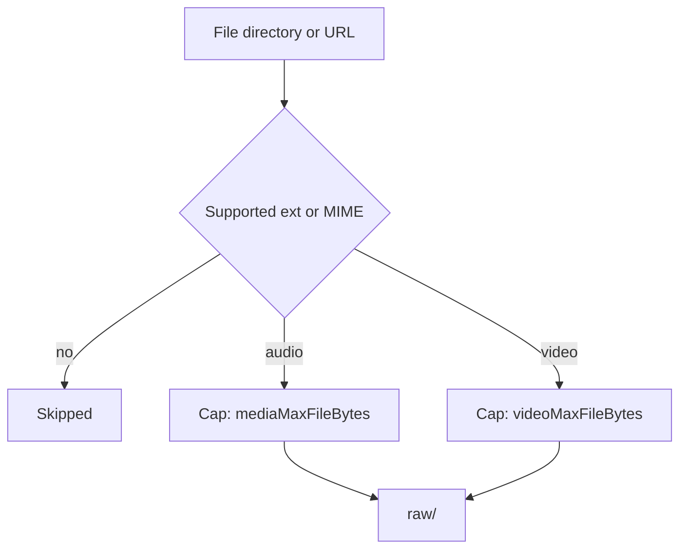
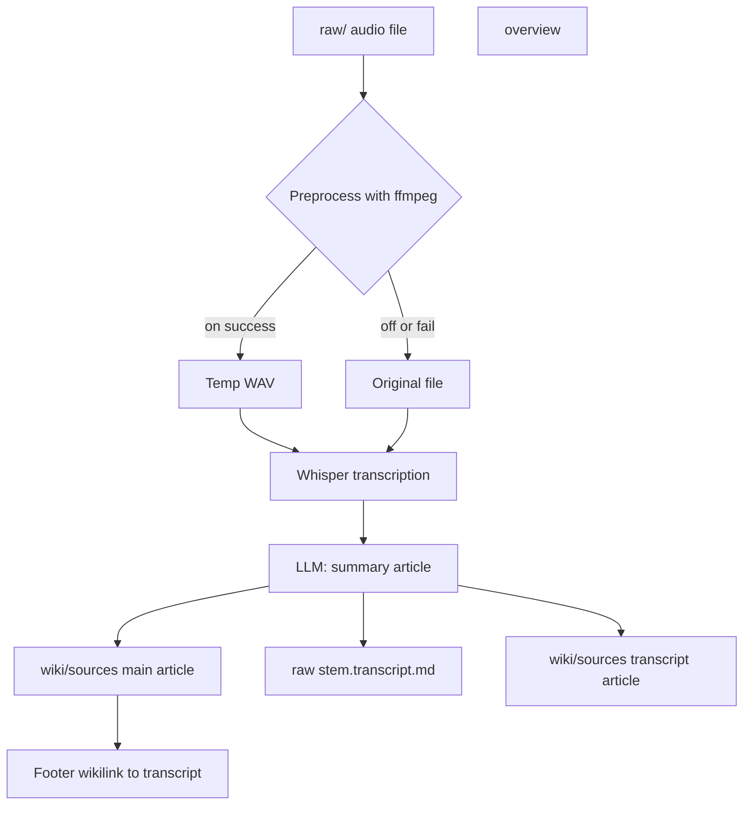
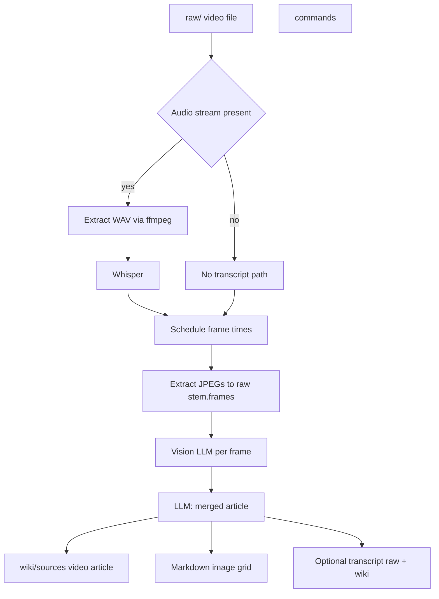

# ingest

Drop articles, papers, images, PDFs, or any text into the pipeline:

```bash
theora ingest ~/Downloads/some-paper.pdf
theora ingest ~/notes/research/*.md --tag transformers
theora ingest ./diagrams/*.png --tag architecture
```

Point it at an entire directory and it walks the tree, picking up every supported file:

```bash
theora ingest ~/research/project-alpha/
theora ingest ~/Downloads/conference-papers/ --tag neurips-2025
```

Ingest URLs directly — web pages are saved as HTML, remote images are downloaded as-is:

```bash
theora ingest https://example.com/article --tag research
theora ingest https://arxiv.org/abs/2310.01234 --tag transformers
theora ingest https://example.com/diagram.png --tag architecture
```

YouTube URLs take a captions-first path: Theora uses `yt-dlp` to fetch metadata plus captions, then stores the transcript as a normal markdown source in `raw/` so compile can treat it like any other text document:

```bash
theora ingest https://www.youtube.com/watch?v=VIDEO_ID --tag research
theora compile
```

You can mix files, directories, and URLs in a single command:

```bash
theora ingest ./local-notes.md https://example.com/article ~/Downloads/paper.pdf --tag project
```

Only valid file types are ingested — everything else is skipped. Duplicates are detected automatically so you can re-run the same ingest without creating copies. Files get copied (flattened) into `raw/`.

## Optional flags

| Flag | Description |
|------|-------------|
| `--tag <tag>` | Categorize sources with a tag (lowercase letters, numbers, hyphens only) |
| `--from <file>` | Ingest from an export zip or KB JSON file (use `-` for stdin) |
| `--compile` | Automatically compile the wiki after ingestion completes |

### Auto-compile after ingest

Add `--compile` to ingest sources and immediately build the wiki in one command:

```bash
theora ingest ~/Downloads/papers/*.pdf --tag research --compile
theora ingest https://example.com/article --tag project --compile
```

This is equivalent to running `theora ingest` followed by `theora compile`.

## Supported file types

| Type | Extensions | How it's compiled |
|------|-----------|-------------------|
| Text | `.md` `.mdx` `.txt` `.html` `.json` `.csv` `.xml` `.yaml` | Read as text, summarized by LLM |
| PDF | `.pdf` | Text extracted, then summarized by LLM |
| Word | `.docx` | Text extracted via mammoth, then summarized by LLM |
| Image | `.png` `.jpg` `.jpeg` `.gif` `.webp` | Analyzed via LLM vision, described and indexed |
| Audio | `.mp3` `.wav` `.ogg` `.flac` `.m4a` | Transcribed with OpenAI Whisper (`whisper-1`), then summarized like text |
| Video | `.mp4` `.mov` `.avi` `.mkv` `.webm` | Requires **ffmpeg** (on macOS, install with [Homebrew](https://brew.sh): `brew install ffmpeg`). Audio transcribed with Whisper; evenly sampled frames analyzed with vision; one merged wiki article |
| YouTube Video | `youtube-<id>.md` | YouTube transcripts ingested via `theora ingest <youtube-url>`. Compiled as **text** (no frame extraction, no ffmpeg). Displays with YouTube icon in wiki. Frontmatter: `source_type: youtube` |
| URL (page) | `http://` `https://` | Fetched as HTML, compiled as text |
| URL (image) | `http://` `https://` | Downloaded, analyzed via LLM vision |
| URL (audio/video) | `http://` `https://` | Streamed to disk; video uses `videoMaxFileBytes`, other media `mediaMaxFileBytes` (same rules as local ingest) |
| URL (YouTube) | `https://www.youtube.com/watch?...` `https://youtu.be/...` | Requires **yt-dlp**. Fetches metadata + captions only, then saves `raw/youtube-<video-id>.md` without downloading video |

## Audio and video: ingest and compile flows

**Ingest** copies or streams files into `raw/` (same extensions as in the table above). Size limits depend on type: audio uses `mediaMaxFileBytes`; video files and `video/*` URL responses use `videoMaxFileBytes`. URL ingest runs an SSRF guard before fetch. Supported YouTube URLs are a captions-first exception: Theora shells out to `yt-dlp`, fetches metadata plus captions, and writes a markdown transcript source instead of downloading media. Companion files produced at compile time (`*.transcript.md`, `{stem}.frames/`) are not separate ingest targets—they are created when you compile.



**Audio compile** — Whisper transcription (OpenAI) then an LLM writes the wiki article. Optional ffmpeg step normalizes to WAV for Whisper when `whisperPreprocessAudio` is on. Verbatim transcript is saved as `raw/{stem}.transcript.md` and a matching wiki source, with links from the main audio article.



**Video compile** — Requires **ffmpeg**. ffprobe detects an audio stream: if none, compilation uses **frame analysis only** (no Whisper, no transcript files). If audio exists, ffmpeg extracts WAV → Whisper → transcript. Preview JPEGs are written to `raw/{stem}.frames/` and shown as a grid in the wiki article; each frame is also sent to **vision** for description before the final LLM merges transcript + frame notes into one article.



Images are especially useful for diagrams, charts, screenshots, and figures from papers. The LLM describes what it sees, extracts any text or data, and links the image from the wiki article so you can view it in Obsidian.

**Whisper and API keys:** Transcription always uses the **OpenAI** audio API (`models.transcribe`, default `whisper-1`). Set `OPENAI_API_KEY`, or use `OPENAI_TRANSCRIBE_API_KEY` if you want a separate key. Chat/vision still follow `provider` in `.theora/config.json` (e.g. Anthropic for compile/vision).

**Media settings** (optional in `.theora/config.json`): `mediaMaxFileBytes` (default 50 MiB for audio, images, documents, etc.), `videoMaxFileBytes` (default 100 MiB for video files and `video/*` URL responses), `videoFramesPerMinute`, `videoMinFrames`, `videoMaxFrames`, `videoFrameVisionMaxEdgePx`, `videoFrameJpegQuality`, `compileMediaTranscriptMaxChars`, `whisperPreprocessAudio`, `whisperAudioTargetSampleRateHz`, `whisperAudioMono`.
