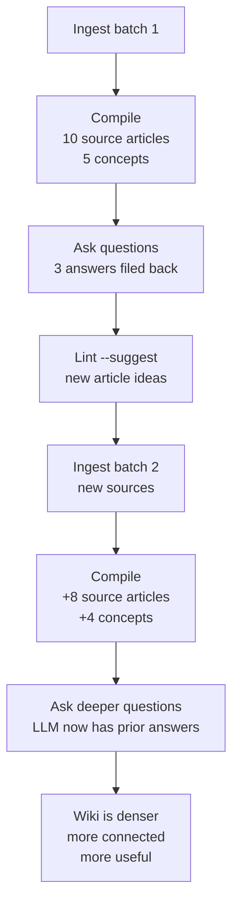

# How It Compounds

A typical session:

1. Ingest 10 papers on a topic
2. `theora compile` produces 10 source summaries + 5 concept articles + an index
3. Ask "what are the main themes?" — answer filed back
4. Ask "where do the authors disagree?" — answer filed back, now cross-referencing the previous answer
5. Ask "what's missing from this research?" — the LLM now has your previous analysis to build on
6. `theora lint --suggest` finds gaps and suggests new articles
7. Ingest more sources, compile again — the wiki grows

Each cycle makes the next one better. The wiki isn't a snapshot — it's a living document that gets smarter every time you interact with it.

