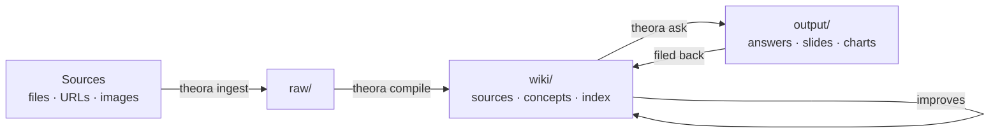
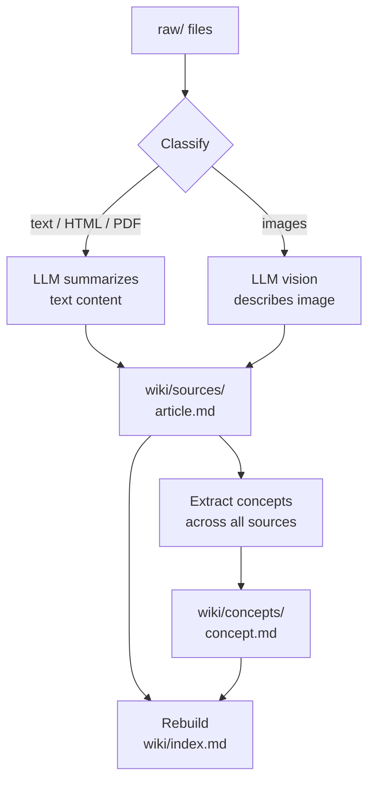
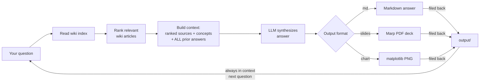
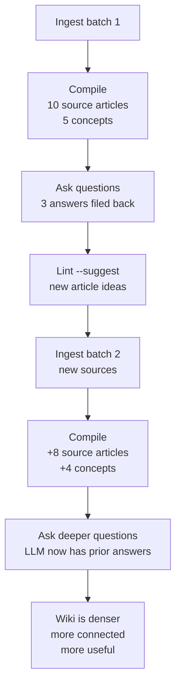

# Why This Works

Most tools treat knowledge as static — you write notes, they sit there. Theora flips this. The LLM writes and maintains everything. You just steer.

The real insight is the loop:

Every answer filed back into the wiki makes the next answer better. The wiki compounds.

## The Compile Pipeline

`theora compile` transforms raw sources into a structured wiki in three stages:

Each source gets its own article with consistent sections — Summary, Key Points, Named Entities, Notable Details. Concepts are extracted across all sources and linked back. The index ties everything together with tags and a brief overview.

Compiled sources also emit structured **entities** in front matter (slug-style keys such as `people/…`, `actors/…` for performers listed under both, `tv-series/…`, `movies/…`, `music-album/…`, `products/…` for commercial items only, plus organizations, places, events, dates). Musical content gets special handling: bands and record labels go under `organizations/…`, individual musicians under `people/…` (often with `musician` role in concepts), and albums under `music-album/…`. Recompile affected sources after prompt updates so existing articles pick up the new buckets.

## The Ask Loop

`theora ask` is where the compounding happens:

The answer is filed back into `output/` and becomes part of the knowledge base. Prior answers are **always** included in context — they bypass the relevance ranker entirely. Every query adds to the base — your explorations compound.

## How the Wiki Improves Over Time

When you ask a question, the LLM researches your wiki, synthesizes an answer, and **files that answer back into the knowledge base**. The next question benefits from every previous answer. Your explorations compound. The wiki gets denser, more connected, more useful — not because you're writing, but because you're asking.

This is a second brain that builds itself.

The bigger implication: agents that own their own knowledge layer don't need infinite context windows. They need good file organization and the ability to read their own indexes. Way cheaper, way more scalable, and way more inspectable than stuffing everything into one giant prompt.
